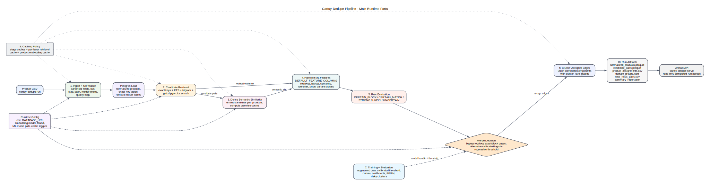

# Dedupe Pipeline

This is the production path implemented in `src/cartsy_dedupe/pipeline.py`.
It is the reviewer-facing runbook for how raw product rows become final
deduped-product artifacts. For model-specific training details, see
`TRAINING.md`.



## Tech Stack

The pipeline is a Python application with a CLI-first runtime and an optional API surface:

- Python package: `cartsy-dedupe`, installed from `pyproject.toml`, exposes the `cartsy-dedupe` CLI.
- Dataframe and numeric layer: Polars loads/writes tabular artifacts, NumPy handles vector math, RapidFuzz computes string similarity, and scikit-learn/joblib run the calibrated logistic-regression model bundle.
- Postgres: normalized products, retrieval helper tables, exact-key tables, and embedding vectors are loaded into a relational database for repeatable candidate generation.
- pgvector: stores product embedding vectors and supports cosine vector retrieval in the candidate cascade.
- `pg_trgm`: powers trigram title similarity for fuzzy lexical retrieval inside normalized brand blocks.
- `unaccent` and Postgres FTS: normalize and rank text search over brand, title, category, specs, and description.
- OpenAI API: creates product text embeddings with `text-embedding-3-small` by default and can run structured attribute extraction when the extraction path is enabled.
- Local cache files: JSON stage caches and embedding caches under `.cache/cartsy-dedupe` avoid recomputing unchanged normalization, retrieval, scoring, clustering, and embedding work.
- FastAPI and Uvicorn: serve completed run artifacts through `cartsy-dedupe serve`; they do not replace the batch pipeline.
- Docker Compose: runs the production-like local Postgres service from `pgvector/pgvector:pg16` and can also run the read-only artifact API container.

Required Postgres extensions are initialized from `sql/001_extensions.sql`:

```sql
CREATE EXTENSION IF NOT EXISTS vector;
CREATE EXTENSION IF NOT EXISTS pg_trgm;
CREATE EXTENSION IF NOT EXISTS unaccent;
```

The main runtime configuration lives in `.env` / `.env.example`: `DATABASE_URL`, `CARTSY_EMBEDDING_PROVIDER`, `CARTSY_EMBEDDING_MODEL`, `CARTSY_EMBEDDING_DIMENSIONS`, `OPENAI_API_KEY`, the ML model path, retrieval fanout settings, and cache toggles. The committed final model is `models/train_20260502_final_submission/cartsy_logreg.joblib`.

## 1. Ingest And Normalize

`cartsy-dedupe run` reads the product CSV, normalizes every row, and loads the normalized products into Postgres. Normalization extracts stable deterministic signals:

- canonical text fields for brand, title, category, description, and specs
- global and marketplace identifiers such as EAN, GTIN, UPC, ASIN, SKU, and URL keys
- size, unit, pack count, model-like tokens, price, and quality flags

Trade-off: normalization stays deterministic and conservative. Open-ended attributes such as color, scent, flavor, and shade are not hardcoded into endless vocabularies.

## 2. Retrieve Candidate Pairs

Candidate generation is recall-oriented and layered:

- exact keys: shared global identifiers, marketplace identifiers, retailer SKU, and trusted canonical product URL keys
- FTS: weighted Postgres full-text search over brand, title, category, specs, and description
- trigram: `pg_trgm` title similarity within normalized brand blocks
- vector: pgvector cosine search, gated by cheap lexical/trigram evidence so embeddings are not global by default

The output is a map of product-index pairs to retrieval evidence strings such as `exact:ean:...`, `lexical:fts:0.5000`, `trigram:title:0.9000`, and `vector:cosine:0.8800`.

Trade-off: retrieval mostly decides which pairs are worth scoring. Strong exact evidence also feeds a high-precision merge policy, but only after URL trust checks and contradiction guards.

## 3. Dense Semantic Similarity

Before scoring, the pipeline embeds every product that appears in at least one candidate pair. It then computes pairwise cosine similarity for every scored candidate pair and stores that value as `semantic_sim`.

Trade-off: this avoids embedding truly unrelated products, but logistic regression still receives a dense semantic feature for all candidate pairs it scores.

## 4. Pairwise ML Features

`src/cartsy_dedupe/features.py` builds the stable pairwise feature contract. `DEFAULT_FEATURE_COLUMNS` is the model contract: adding, removing, or reordering columns invalidates existing `.joblib` bundles and requires retraining.

| Feature | Meaning |
|---|---|
| `same_retailer` | 1 if both products come from the same retailer |
| `brand_exact` | 1 if normalized brand strings are identical |
| `brand_fuzzy` | Levenshtein ratio of normalized brand strings |
| `title_token_set` | Token-set ratio of normalized product titles |
| `title_partial` | Partial ratio of normalized product titles |
| `category_exact` | 1 if leaf category segments are identical |
| `model_token_jaccard` | Jaccard similarity of extracted alphanumeric model tokens |
| `salient_token_jaccard` | Jaccard similarity of title tokens after removing brand, category, stopwords, and digit tokens |
| `size_match` | 1 if both products have an unambiguous size and they are equivalent |
| `size_conflict` | 1 if both products have an unambiguous size and they differ |
| `pack_match` | 1 if both products have an explicit pack count and they agree |
| `pack_conflict` | 1 if both products have an explicit pack count and they differ |
| `price_ratio_diff` | Absolute relative price difference — `|p1-p2| / max(p1,p2)` |
| `price_both_present` | 1 if both products have a non-null price |
| `identifier_any` | 1 if any shared identifier was found (in-product or from retrieval evidence) |
| `exact_global_id` | 1 if a shared EAN, GTIN, or UPC was found in retrieval evidence |
| `exact_ean` | 1 if product-level EAN values agree |
| `exact_gtin` | 1 if product-level GTIN values agree |
| `exact_upc` | 1 if product-level UPC values agree |
| `exact_asin` | 1 if ASIN values agree (product-level or retrieval evidence) |
| `exact_retailer_sku` | 1 if a same-retailer SKU key was found in retrieval evidence |
| `exact_canonical_url` | 1 if a canonical product URL key was found in retrieval evidence |
| `exact_key_count` | Number of distinct exact identifier types matched |
| `exact_evidence_strength` | Scalar strength of strongest exact evidence (1.0 for global ID, 0.92 for ASIN, …) |
| `exact_sku_same_retailer` | 1 if SKU matches within the same retailer |
| `exact_sku_cross_retailer` | 1 if SKU matches across different retailers |
| `rule_certain_match` | 1 if `CERTAIN_MATCH` fired (EAN/GTIN/UPC/ASIN/URL) |
| `rule_strong_match` | 1 if `STRONG_MATCH` fired (retailer SKU or brand+title≥0.95 with model overlap) |
| `rule_likely_match` | 1 if `LIKELY_MATCH` fired (brand+title≥0.85+size, or brand+model overlap+title≥0.70) |
| `rule_certain_block` | 1 if `CERTAIN_BLOCK` fired (hard contradiction detected) |
| `lexical_sim` | Normalized FTS rank from the lexical retrieval layer |
| `trigram_sim` | Trigram title similarity from the trigram retrieval layer |
| `semantic_sim` | Cosine similarity of dense product embeddings |
| `retrieval_layer_count` | Number of distinct retrieval layers (exact/lexical/trigram/vector) that surfaced the pair |
| `variant_conflict` | 1 if same brand but salient title tokens are disjoint |
| `variant_token_conflict` | 1 if explicit variant tokens disagree, such as shade codes or color words |
| `variant_token_presence_mismatch` | 1 if only one side has an explicit variant token while titles otherwise strongly contain each other |
| `kit_standalone_conflict` | 1 if one side is a kit/multi-component product and the other is a standalone item |
| `kit_count_conflict` | 1 if both sides are kits but explicit product/item counts differ |
| `kit_component_conflict` | 1 if both sides are kits but their parsed component terms do not overlap |
| `product_form_conflict` | 1 if explicit product form terms disagree, such as shampoo vs conditioner |
| `weak_exact_contradiction` | 1 if shared weak identifier evidence coexists with explicit identity contradictions |
| `contradiction_count` | Count of contradiction feature families active for the pair |
| `contradiction_strength` | Max contradiction strength, used for diagnostics and evidence penalties |
| `feature_coverage_count` | Count of indicator features carrying non-zero signal; low values flag sparse-evidence pairs |

## 5. Rule Evaluation And Merge Decision

Each candidate pair first passes through an ordered condition chain in `src/cartsy_dedupe/scoring.py`. The chain returns one of five certainty levels:

| Level | What it means | Pipeline action |
|---|---|---|
| `CERTAIN_BLOCK` | Hard contradiction (conflicting global ID, brand, size, or pack count) | score=0.0, skip ML |
| `CERTAIN_MATCH` | Exact global ID (EAN/GTIN/UPC), ASIN, or trusted canonical URL | score=1.0, skip ML |
| `STRONG_MATCH` | Same-retailer SKU, or brand+title≥0.95 with model overlap | ML scores pair; certainty is a feature |
| `LIKELY_MATCH` | Brand+title≥0.85+size match, or brand+model overlap+title≥0.70 | ML scores pair; certainty is a feature |
| `UNCERTAIN` | No clear signal either way | ML scores pair; certainty is a feature |

For pairs that reach the ML model:

```python
rule_decision = evaluate_rule(left, right)
pair_features = build_pair_features(..., rule_decision=rule_decision)
ml_score = calibrated_logistic_regression.predict_proba(pair_features)
evidence_score = pair_evidence_score(...)

if rule_decision.certainty == CERTAIN_MATCH:
    decision = "merge"                          # bypass ML
elif rule_decision.certainty == CERTAIN_BLOCK:
    decision = "no_merge"                       # bypass ML
elif hard_contradiction_features(pair_features):
    decision = "no_merge"                       # ML called, but score capped
elif ml_score >= threshold and evidence_score >= evidence_merge_threshold:
    decision = "merge"
else:
    decision = "no_merge"
```

Canonical URLs are trusted only when they look like product pages; click/count/redirect/tracking paths are filtered by `canonicalize_url` before insertion into the exact-key table.

`hard_contradiction_features` is intentionally small and generic: factual size/pack conflicts, explicit shade/color/model-token conflicts, one-sided explicit variant-token mismatches, kit count conflicts, and kit/standalone or incompatible-kit conflicts. Broader weak signals, such as product-form disagreement, remain model features and evidence penalties rather than scattered one-off guards.

`evidence_merge_threshold` defaults to `0.78`. This is a runtime safety gate for sparse or borderline candidate pairs, especially vector-only and high-similarity same-family pairs: the model can still score them, but a high `ml_score` alone is not enough to create a merge edge when independent evidence is weak.

Trade-off: deterministic certainty conditions handle the obvious cases without ML inference overhead. The calibrated logistic regression remains the probability surface for everything in between, but uncertain pairs also need enough corroborating evidence before they can affect clustering.

## 6. Cluster Accepted Merge Edges

Accepted merge pairs become graph edges. `src/cartsy_dedupe/clustering.py` unions connected components into final `dedupe_id` groups and keeps cluster-level guards against unsafe connected-component spillover.

Trade-off: the model scores pairs, while clustering handles group construction. A cluster can be blocked even when an individual edge looks attractive if the group-level evidence becomes contradictory.

## 7. Training And Evaluation

Training is documented in detail in `TRAINING.md`. Operationally, the runtime
expects a model bundle whose `feature_columns` exactly match
`src/cartsy_dedupe/features.py::DEFAULT_FEATURE_COLUMNS`; stale bundles are
rejected at startup instead of silently scoring with the wrong feature order.

The committed final submission bundle lives at:

```text
models/train_20260502_final_submission/cartsy_logreg.joblib
models/train_20260502_final_submission/metrics.json
models/train_20260502_final_submission/feature_coefficients.csv
models/train_20260502_final_submission/threshold_curve.csv
models/train_20260502_final_submission/calibration_threshold_curve.csv
```

The training path has two commands:

```bash
cartsy-dedupe augment-training-data \
  --input data/products.csv \
  --ground-truth data/ground_truth_merged.csv \
  --output-data data/dataset_merged_augmented.csv \
  --output-ground-truth data/ground_truth_merged_augmented.csv \
  --output-manifest data/augmentation_manifest_merged.csv \
  --duplicate-samples 5000 \
  --hard-negative-samples 1000
```

```bash
cartsy-dedupe train-model \
  --products data/dataset_merged_augmented.csv \
  --ground-truth data/ground_truth_merged_augmented.csv \
  --output-dir models/train_YYYYMMDD_final_submission \
  --target-precision 0.97 \
  --min-recall 0.80 \
  --cv-folds 5 \
  --max-positive-pairs 20000 \
  --max-hard-negative-pairs 60000 \
  --use-embeddings
```

Training writes threshold curves, precision/recall/F1, calibration diagnostics,
false positives, false negatives, feature coefficients, filtered contradiction
positives, and risky predicted clusters. Positive training pairs that trigger
hard contradiction features are filtered because runtime policy will not merge
those pairs. Keeping them as positives would teach unsafe coefficient signs.

Completed runs should be evaluated against labels before a model is treated as
release-ready:

```bash
cartsy-dedupe evaluate-run \
  --run outputs/run_YYYYMMDD_HHMMSS \
  --ground-truth data/ground_truth_merged.csv \
  --min-precision 0.97 \
  --min-recall 0.80 \
  --min-vector-only-precision 0.95
```

The command writes `labeled_evaluation.json` with overall precision/recall/F1
and risk slices such as vector-only, generic-brand, exact, lexical, trigram, and
vector evidence. Blank `deduped_id` labels are ignored by default so accidental
empty-label clusters do not inflate positives.

## 8. Retrieval Defaults

The production recall profile should keep all retrieval layers enabled:

```bash
CARTSY_FTS_CANDIDATES=25
CARTSY_TRIGRAM_CANDIDATES=25
CARTSY_TRIGRAM_MIN_SIMILARITY=0.55
CARTSY_VECTOR_CANDIDATES=25
```

Trade-off: this creates more candidates than the smoke-test profile, but candidate generation had not been the observed bottleneck in the regression runs. The loss was in merge policy, so retrieval should stay recall-oriented after exact behavior is restored.

## 9. Caching Policy

Stage-level caching is enabled by default in the main run path. Normalization, retrieval, scoring, and clustering write JSON cache files under `CARTSY_PIPELINE_CACHE_DIR` (default `.cache/cartsy-dedupe`) and reuse them when the input, config, environment, and code fingerprints match.

Set `CARTSY_STAGE_CACHE_ENABLED=false` to force stage recomputation. `summary_report.json` includes `stage_caches` with each cache key, path, enabled flag, and hit status.

Per-layer retrieval caching is also enabled when stage caching is enabled, so exact, FTS, trigram, and vector retrieval rows can be reused independently before the full retrieval-stage cache exists.

Product embedding caching is active by default and can be controlled separately with `CARTSY_EMBEDDING_CACHE_ENABLED=false`. It is keyed by product embedding text, normalization key, model, dimensions, and code fingerprint, so embeddings are reused across repeated runs on the same products and save OpenAI API cost.

Training runs with `--use-embeddings` also reuse product embedding caches. They first look for a matching dedupe embedding matrix cache (`embeddings_<normalization_key>_*.npy` plus `source_id_to_index.json`) for the same products file, then fall back to text-hash JSON embedding caches before creating any missing embeddings.

## 10. Run Artifacts

Each run writes:

- `normalized_products.parquet`
- `candidate_pairs.parquet`
- `product_assignments.csv`
- `dedupe_groups.jsonl`
- `near_miss_pairs.csv`
- `summary_report.json`

`candidate_pairs.parquet` and `near_miss_pairs.csv` expose separate score
concepts:

- `ml_score`: calibrated model probability for the pair.
- `evidence_score`: human-facing multi-signal confidence from exact keys,
  lexical/trigram evidence, semantic similarity, rule features, and model score.
- `decision_threshold`: model threshold loaded from the bundle after applying
  the runtime floor.
- `evidence_merge_threshold`: runtime evidence floor required for non-rule ML
  merges.
- `decision_reason`: the final merge/no-merge policy reason.
- `score`: the display confidence, currently equal to `evidence_score`.

Accepted exact-policy merges can therefore have low `ml_score` but high
`evidence_score`; that is intentional and keeps policy decisions explainable
instead of flattening confidence to the model threshold.
No-merge pairs below the near-miss threshold are normally dropped from artifacts,
but `below_evidence_threshold` pairs are retained when the model score exceeded
the merge threshold. These are high-value calibration examples: the model wanted
to merge, but independent evidence was too weak.

The durable artifact files are the source of truth for completed-run search, explanations, and API responses.
