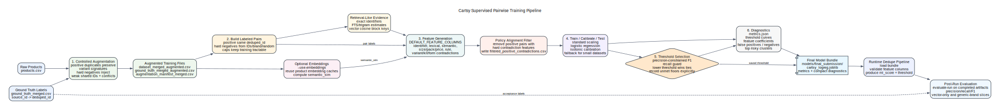

# Training Pipeline

This document explains how the supervised pairwise model is built, evaluated, and used by the runtime dedupe pipeline.



## Goal

The model answers one narrow question: given two candidate products that retrieval already surfaced, what is the calibrated probability that they represent the same purchasable item?

It does not replace deterministic policy. Runtime still blocks factual contradictions and can fast-path high-trust exact matches. The model handles the uncertain middle where lexical, semantic, identifier, and variant evidence need to be weighed together.

## Inputs

Expected full-data training inputs:

```text
data/products.csv
data/ground_truth_merged.csv
```

`products.csv` contains raw product rows. `ground_truth_merged.csv` maps `source_id` to a canonical `deduped_id`. Most labels are singletons, so the raw label file alone does not provide enough positive duplicate mass for a stable pairwise model.

The tiny committed `data/products_first20.csv` is only a smoke fixture. It is not a meaningful training set.

## Step 1: Controlled Augmentation

```bash
.venv/bin/cartsy-dedupe augment-training-data \
  --input data/products.csv \
  --ground-truth data/ground_truth_merged.csv \
  --output-data data/dataset_merged_augmented.csv \
  --output-ground-truth data/ground_truth_merged_augmented.csv \
  --output-manifest data/augmentation_manifest_merged.csv \
  --duplicate-samples 5000 \
  --hard-negative-samples 1000
```

The augmenter creates two kinds of rows:

- Guarded positive duplicates: title reorder, light field removal, retailer/price jitter, and identifier-presence changes while preserving variant-defining cues such as size, pack count, shade/model-like tokens, and kit/component hints.
- Dirty-identifier hard negatives: confusing same-brand or shared-weak-identifier rows with variant conflicts, used to teach the model that similar products can still be different purchasable items.

Positive synthetic rows keep the original `deduped_id`. Hard negatives receive singleton labels starting at `500000+`.

## Step 2: Pair Construction

`build_training_pairs(...)` creates labeled pair examples:

- Positive pairs from products sharing a nonblank `deduped_id`.
- Hard negatives from identifier buckets, brand buckets, and random cross-label sampling.
- Optional caps through `--max-positive-pairs` and `--max-hard-negative-pairs` so training remains tractable.

The trainer infers retrieval-like `block_keys` for each pair so feature generation sees evidence strings similar to runtime, such as exact identifiers, FTS scores, trigram scores, and vector cosine scores.

## Step 3: Feature Generation

`src/cartsy_dedupe/features.py` owns the model contract. `DEFAULT_FEATURE_COLUMNS` is ordered and must stay aligned with the saved `.joblib` bundle.

Feature families include:

- Retailer, brand, title, category, model-token, salient-token, size, pack, and price signals.
- Exact evidence flags for global IDs, ASIN, same-retailer SKU, canonical URLs, and exact-key strength.
- Rule indicators from `evaluate_rule(...)`.
- Retrieval evidence features: lexical FTS rank, trigram similarity, semantic cosine similarity, and retrieval-layer count.
- Variant and contradiction features: explicit variant conflicts, one-sided variant-token presence, kit/standalone conflicts, kit count/component conflicts, product-form conflicts, weak exact contradictions, contradiction count, and contradiction strength.
- Feature coverage count, which helps identify sparse-evidence pairs.

When `--use-embeddings` is enabled, training computes `semantic_sim` for candidate pairs and reuses compatible embedding caches when possible.

## Step 4: Model Training

```bash
.venv/bin/cartsy-dedupe train-model \
  --products data/dataset_merged_augmented.csv \
  --ground-truth data/ground_truth_merged_augmented.csv \
  --output-dir models/train_YYYYMMDD_final_submission \
  --target-precision 0.97 \
  --min-recall 0.80 \
  --cv-folds 5 \
  --max-positive-pairs 20000 \
  --max-hard-negative-pairs 60000 \
  --use-embeddings
```

The trainer uses logistic regression with standard scaling. For normal-sized datasets it creates train, calibration, and test splits. The base model is calibrated with isotonic calibration so `predict_proba` is more useful as a merge probability on imbalanced data.

Threshold selection is precision-constrained:

- Prefer the best-F1 threshold that satisfies `--target-precision`.
- Also require `--min-recall` so the threshold cannot satisfy precision by merging almost nothing.
- If no threshold satisfies both, record that the precision floor was unmet and use the best available operating point instead of hiding the trade-off.
- When thresholds tie on precision, recall, and F1, prefer the lower threshold so calibrated plateaus do not become needlessly strict.

## Step 5: Training Artifacts

Each training run writes:

```text
cartsy_logreg.joblib
metrics.json
threshold_curve.csv
calibration_threshold_curve.csv
feature_coefficients.csv
false_positives.csv
false_negatives.csv
top_risky_clusters.csv
filtered_positive_contradictions.csv
training_embedding_products.json
```

The committed final-submission subset keeps the model and compact reviewer diagnostics under `models/train_20260502_130136_final_submission/`.

`metrics.json` records the chosen threshold, target precision, recall guard, CV thresholds, calibration status, pair counts, filtered contradiction positives, test average precision, test precision/recall/F1, embedding provider, and artifact list.

## Step 6: Runtime Use

At runtime, `DedupePipeline.load_ml_model(...)` validates that the bundle feature columns are compatible with the current `DEFAULT_FEATURE_COLUMNS`. Incompatible bundles fail fast.

For a candidate pair:

1. Deterministic rule evaluation runs first.
2. Hard `CERTAIN_BLOCK` contradictions become no-merge immediately.
3. High-trust `CERTAIN_MATCH` exact evidence can merge immediately.
4. Uncertain pairs are converted to the model feature vector.
5. Logistic regression produces `ml_score`.
6. Independent evidence produces `evidence_score`.
7. Non-rule ML merges require both `ml_score >= decision_threshold` and `evidence_score >= evidence_merge_threshold`.

This separation is intentional: the model is the probability surface, while the evidence threshold protects clustering from sparse vector-only or same-family overconfidence.

## Step 7: Post-Run Evaluation

```bash
.venv/bin/cartsy-dedupe evaluate-run \
  --run outputs/run_YYYYMMDD_HHMMSS \
  --ground-truth data/ground_truth_merged.csv
```

Add acceptance floors for release checks:

```bash
.venv/bin/cartsy-dedupe evaluate-run \
  --run outputs/run_YYYYMMDD_HHMMSS \
  --ground-truth data/ground_truth_merged.csv \
  --min-precision 0.97 \
  --min-recall 0.80 \
  --min-vector-only-precision 0.95
```

The evaluator writes `labeled_evaluation.json` with overall precision/recall/F1 and risk slices for exact, lexical, trigram, vector, vector-only, and generic-brand pairs.

## Reviewer Checklist

- Confirm `models/train_20260502_130136_final_submission/metrics.json` and `feature_coefficients.csv` are present.
- Confirm the model threshold and feature columns match `DEFAULT_FEATURE_COLUMNS`.
- Inspect `false_positives.csv`, `false_negatives.csv`, and `top_risky_clusters.csv` after any retraining.
- Run `evaluate-run` against the full labeled dataset before changing runtime thresholds.
- Update this file and `PIPELINE.md` whenever model features, threshold policy, or runtime merge policy changes.
