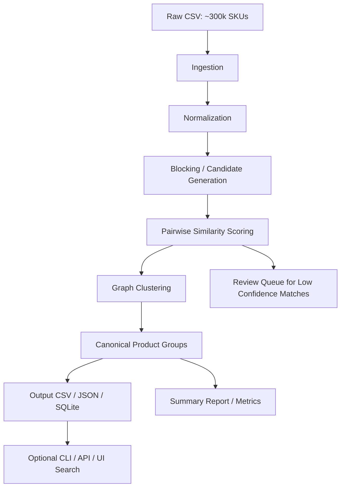
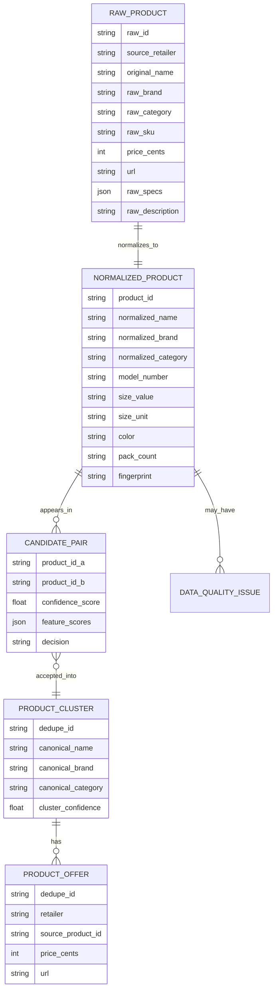
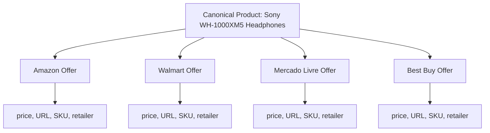
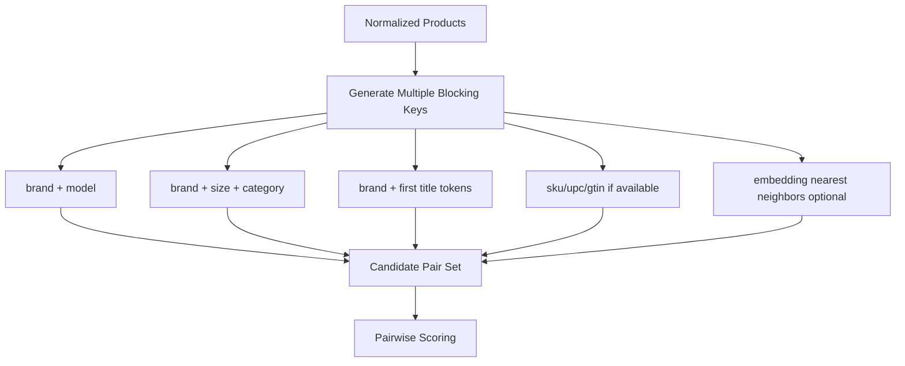
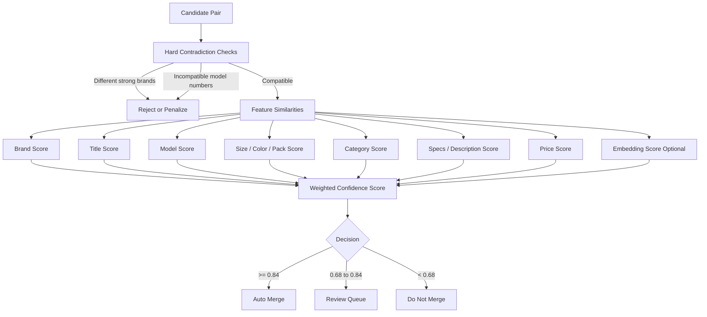
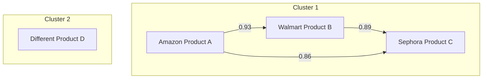
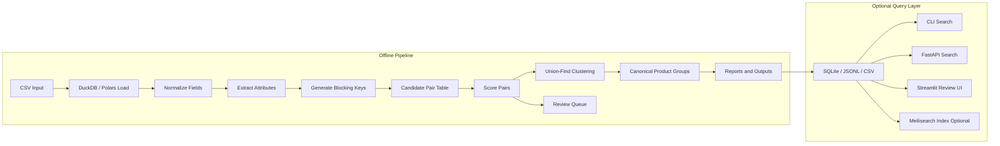
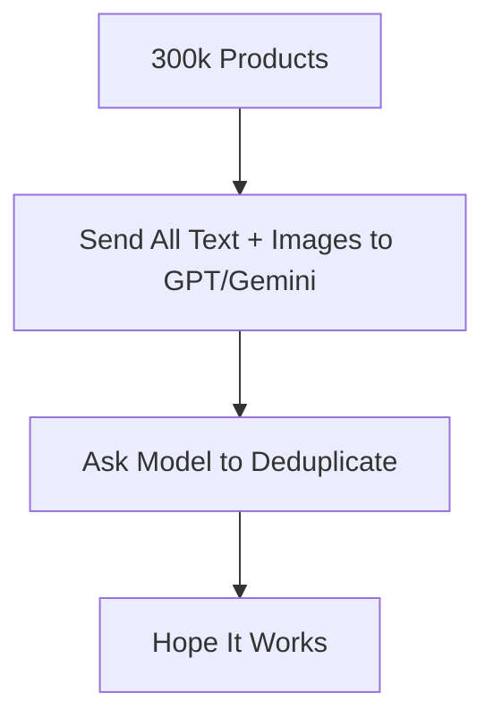
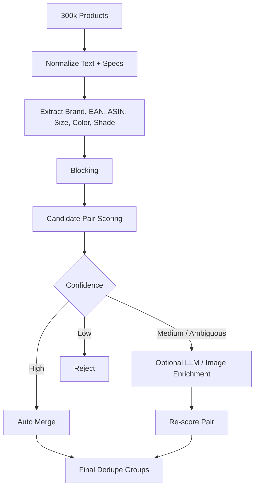

# me
[attached "info/Coding Challenge Spec.pdf" and "info/intro-meeting-transcript.txt"]
based on the provided information from my meeting on the take home assessment from Cartsy, help me think about how to solve the problem. figure out architecture, tech stack, and details. analyze if there are any similar projects and technologies done in this context that may help. draw diagrams for understanding of the architecture, and be detailed.

# chatgpt
Bernardo, I’d approach this as **an entity-resolution / product-matching pipeline**, not as a normal CRUD app. The challenge is asking you to ingest messy product rows, normalize them, generate dedupe groups, assign confidence scores, and make the output easy to inspect. Cartsy explicitly says the core is deduplication quality, not UI polish, and they care about whether the system works, how you reason about fuzzy matching, and how clearly you explain tradeoffs. 

My strongest recommendation: **build a working CLI/data pipeline first**, generate excellent output files and reports, then add a tiny query/review interface only if time allows.

---

# 1. What you are actually solving

From your meeting notes, the real input is likely around **300k SKUs** from retailers like Amazon, Mercado Livre, Sephora, Walmart, Beleza na Web, etc. The CSV is already somewhat normalized and should contain fields like product name, brand, category, description, specs, created date, retailer, price in cents, SKU, size/dimensions, URL, and maybe images. 

The output they really want is:

```text
raw product row -> normalized product -> dedupe_id -> confidence score -> explanation
```

For example:

```text
Amazon:  Cetaphil Moisturizing Lotion 16 fl oz
Walmart: Cetaphil Daily Hydrating Lotion 16oz
Sephora: Cetaphil Hydrating Body Lotion, 473 ml

=> same dedupe_id, high confidence, explanation:
brand match, title similarity high, size equivalent, category compatible
```

This is the mental model:



The danger is trying to compare every product with every other product. For 300k rows, full pairwise matching is:

```text
300,000 * 300,000 = 90 billion comparisons
```

Absolutely not happening. So the architecture needs **candidate generation** first.

---

# 2. Recommended tech stack

## Best stack for this take-home

I would personally use:

```text
Python + DuckDB + Polars or Pandas + RapidFuzz + optional embeddings
```

Reason: this is a data pipeline / entity-resolution challenge, and Python has much stronger libraries for fuzzy matching, data cleaning, and embeddings. RapidFuzz is a fast fuzzy string matching library implemented with optimized C++ internals, useful for product title and brand similarity. ([RapidFuzz][1]) DuckDB is excellent for local CSV processing because it can auto-detect CSV dialects and types and can query CSVs directly. ([DuckDB][2])

Cartsy prefers TypeScript/Node, but your meeting notes say the focus is output and strategy, and the spec says language is flexible even though TypeScript/Node is preferred.  If you choose Python, explain it directly in the README:

> I chose Python for the core pipeline because this challenge is primarily data processing and entity resolution. In a production Cartsy stack, this could run as a scheduled worker, or the scoring logic could be ported to TypeScript once validated.

That is a mature answer, not an excuse.

## Optional stack-aligned version

If you want to optimize for Cartsy’s internal stack:

```text
TypeScript + Node.js + DuckDB + csv-parse + custom fuzzy scoring + optional Next.js UI
```

But the dedupe quality may be worse unless you spend time rebuilding things Python already gives you.

My pick for a 3 to 4 day challenge: **Python core pipeline, maybe a tiny Streamlit or FastAPI interface only if the core is done.**

---

# 3. Architecture I would build

## Folder structure

```text
cartsy-product-dedupe/
  README.md
  pyproject.toml
  data/
    input/
      products.csv
    output/
      normalized_products.csv
      product_groups.jsonl
      product_assignments.csv
      candidate_pairs_sample.csv
      low_confidence_review.csv
      summary_report.json
  src/
    cartsy_dedupe/
      cli.py
      ingest.py
      normalize.py
      blocking.py
      scoring.py
      clustering.py
      canonicalize.py
      reporting.py
      quality.py
      utils.py
  tests/
    test_normalize.py
    test_scoring.py
    test_clustering.py
```

## CLI commands

```bash
python -m cartsy_dedupe ingest data/input/products.csv
python -m cartsy_dedupe run data/input/products.csv --out data/output
python -m cartsy_dedupe search "sony wh1000xm5"
python -m cartsy_dedupe report data/output/summary_report.json
```

Or one clean command:

```bash
python -m cartsy_dedupe run \
  --input data/input/products.csv \
  --output data/output \
  --auto-threshold 0.84 \
  --review-threshold 0.68
```

This is enough. They said a query interface is optional, and a CSV/JSON/table with dedupe IDs and scores is sufficient based on your meeting notes. 

---

# 4. Data model

Do not merge everything into one flat table too early. Separate **raw records**, **normalized records**, **candidate pairs**, and **final product clusters**.



## Canonical schema

I’d define normalized rows like this:

```python
NormalizedProduct = {
    "source_id": str,
    "retailer": str,
    "source_sku": str | None,
    "url": str | None,

    "name_raw": str,
    "brand_raw": str | None,
    "category_raw": str | None,
    "description_raw": str | None,
    "specs_raw": dict | None,

    "name_norm": str,
    "brand_norm": str | None,
    "category_norm": str | None,
    "description_norm": str | None,
    "specs_text": str | None,

    "model_tokens": list[str],
    "size_value": float | None,
    "size_unit": str | None,
    "color": str | None,
    "pack_count": int | None,

    "price_cents": int | None,
    "created_at": str | None,

    "quality_flags": list[str]
}
```

Important design choice: **canonical product is not the same thing as an offer.**

A product group should represent the real-world item. The source rows are offers/listings from different retailers.



That distinction will make you sound much more senior in the walkthrough.

---

# 5. Normalization strategy

The normalization layer is where you win a lot of accuracy before any ML.

## Text normalization

For names, brands, categories, and descriptions:

```text
1. Lowercase
2. Remove accents
3. Normalize whitespace
4. Remove punctuation that does not matter
5. Normalize hyphenated model names
6. Remove retailer-specific garbage
7. Normalize units
8. Extract structured attributes
```

Examples:

```text
"WH1000XM5 - Sony Wireless Noise Cancelling"
=> "sony wh 1000 xm5 wireless noise cancelling"

"Stanley Quencher H2.0 FlowState Tumbler 40oz"
=> brand=stanley, model=h2.0 flowstate, size=40 oz

"473 ml"
=> 16 fl oz approximately, or preserve both and compare with tolerance
```

## Extract high-signal attributes

These matter more than description embeddings:

```text
brand
model number
size
unit
color
pack count
category
SKU / UPC / GTIN / EAN if present
```

Especially for products like electronics, model numbers are king:

```text
WH-1000XM5
iPhone 15 Pro
Dyson V15
K18
CeraVe PM
```

For beauty, health, and grocery, size is king:

```text
16 oz
473 ml
100 g
pack of 2
shade 220
```

## Specs JSON flattening

Your notes say specs and descriptions are JSONs but not standardized, and may vary across retailers.  I would flatten them into a stable text form:

```python
def flatten_specs(specs):
    # {"Color": "Black", "Size": "40 oz"} 
    # => "color black size 40 oz"
```

Then use both:

```text
structured extraction: size/color/model
text similarity: specs_text similarity
```

---

# 6. Candidate generation: the most important scaling piece

Do not compare all pairs. Generate likely pairs using **blocking keys**.



## Blocking keys I would create

Each product can belong to multiple blocks:

```python
blocking_keys = [
    f"sku:{sku_norm}" if sku else None,
    f"brand_model:{brand_norm}:{model_token}" if brand and model else None,
    f"brand_size_cat:{brand_norm}:{size_value}:{size_unit}:{category_norm}",
    f"brand_title_prefix:{brand_norm}:{top_3_title_tokens}",
    f"model:{model_token}" if model_token_is_specific else None,
]
```

Examples:

```text
Sony WH-1000XM5 Wireless Headphones
keys:
brand_model:sony:wh1000xm5
model:wh1000xm5
brand_title_prefix:sony:wireless noise cancelling
```

For generic products, block carefully:

```text
"black dress"
"water bottle"
"face cream"
```

These blocks can explode. Add safeguards:

```text
If block size > 2,000, skip it or require another constraint.
If brand is missing, require model or highly specific tokens.
If category is missing, rely more on brand/model/title.
```

This is one of the most important README explanations. It shows you understand scale.

---

# 7. Pairwise confidence scoring

The challenge explicitly asks you to explain a confidence scoring strategy.  I would make the score interpretable, feature-based, and explainable.

## Pair scoring diagram



## Suggested formula

Start simple and explainable:

```text
confidence =
  0.20 * brand_score
+ 0.25 * title_score
+ 0.20 * model_score
+ 0.15 * variant_score
+ 0.07 * category_score
+ 0.08 * specs_description_score
+ 0.05 * price_score
+ identifier_bonus
- contradiction_penalty
```

Where:

```text
brand_score:
  1.0 if normalized brands match
  0.85 if alias match, e.g. "l'oreal" vs "loreal paris"
  0.0 if both present and clearly different

title_score:
  RapidFuzz token_set_ratio or weighted fuzzy score

model_score:
  1.0 if same extracted model number
  0.0 if no model information
  strong penalty if incompatible model numbers

variant_score:
  size/color/pack count compatibility

category_score:
  exact or parent-category compatibility

specs_description_score:
  fuzzy similarity or embedding similarity over flattened specs + description

price_score:
  weak signal only, because prices vary by retailer

identifier_bonus:
  strong boost for UPC/GTIN/EAN exact match
  moderate boost for SKU match, but careful because SKU may be retailer-specific

contradiction_penalty:
  large penalty for different strong brands, incompatible model numbers, incompatible size when size defines product
```

This is the kind of scoring they can inspect.

## Thresholds

I’d use three buckets:

```text
score >= 0.84:
  auto merge

0.68 <= score < 0.84:
  possible duplicate, send to review_queue.csv

score < 0.68:
  do not merge
```

Why not auto-merge everything above 0.70? Because false positives are worse than false negatives in product dedupe. A bad merge can connect the wrong shopping link to content. Missing a duplicate is annoying, but incorrectly merging a sunscreen with a lotion is worse.

Say that in the README. That is a good product judgment.

---

# 8. Hard rules and edge cases

You should include deterministic rules before fuzzy scoring.

## Strong positive rules

Auto high confidence when:

```text
same UPC / GTIN / EAN
same brand + same model number
same brand + very similar title + same size
same brand + same normalized SKU, if SKU appears globally meaningful
```

## Strong negative rules

Reject or heavily penalize when:

```text
different known brands
different model numbers
different product type
different size when size defines the SKU
different color when color defines the SKU
one says "pack of 2" and the other says "single", unless price and title suggest bundle equivalence
```

## Ambiguous product variant policy

You need to choose a definition of “same product.”

I would define:

```text
Two records are duplicates if they represent the same purchasable product variant, not merely the same product family.
```

So:

```text
Stanley Quencher 40 oz pink
Stanley Quencher 40 oz black
```

should probably **not** be merged if color matters.

But:

```text
Cetaphil Moisturizing Lotion 16 oz
Cetaphil Moisturizing Lotion 473 ml
```

can be merged because size is equivalent.

For electronics:

```text
Sony WH-1000XM5 black
Sony WH-1000XM5 silver
```

This is tricky. You can either treat color variants as separate SKUs or same product family. Because the challenge asks for unique IDs grouping equivalent products and SKUs, I would treat **different color as different variant unless unclear**. Then put color conflicts in review.

That is safer.

---

# 9. Clustering strategy

Once you score candidate pairs, you need groups.

Simplest approach:

```text
Create graph:
  node = normalized product
  edge = candidate pair with score >= auto_merge_threshold

Then connected components = dedupe groups.
```

Use union-find.



But beware of chain errors:

```text
A similar to B
B similar to C
C similar to D
But A not actually similar to D
```

To prevent this, add a cluster validation step:

```text
Before unioning two clusters:
  compare candidate product against cluster representative
  require no hard contradictions with existing cluster members
  require average or max similarity above threshold
```

For a take-home, you can implement:

```python
if pair_score >= auto_threshold and no_cluster_contradiction(a, b):
    union(a, b)
```

Then compute cluster confidence:

```text
cluster_confidence = minimum accepted edge score inside cluster
```

This is conservative and easy to explain.

---

# 10. Canonical merging strategy

Do not destroy source data. Preserve all offers.

## Output group example

```json
{
  "dedupe_id": "prod_8f21ab3c",
  "canonical_name": "Sony WH-1000XM5 Wireless Noise Cancelling Headphones",
  "canonical_brand": "Sony",
  "canonical_category": "Headphones",
  "cluster_confidence": 0.91,
  "num_offers": 3,
  "retailers": ["Amazon", "Walmart", "Mercado Livre"],
  "price_min_cents": 29900,
  "price_max_cents": 39900,
  "source_ids": ["amz_123", "wmt_456", "ml_789"],
  "merge_reasons": [
    "same model token: wh1000xm5",
    "brand match: sony",
    "high title similarity: 0.89",
    "category compatible: headphones"
  ]
}
```

## Canonical field selection

For each cluster:

```text
canonical_brand:
  most frequent normalized brand

canonical_name:
  best-quality title:
    not too short
    contains brand
    contains model/size
    clean formatting
    maybe longest title after removing junk

canonical_category:
  most frequent non-null category

price:
  do not pick one canonical price
  preserve offers and report min/max/median

description/specs:
  preserve all raw source values
  optionally choose longest/highest quality description
```

This is important because conflicting prices/descriptions are expected in the challenge. 

---

# 11. Observability and reporting

Cartsy explicitly asks for reporting like number of records, duplicates found, confidence distribution, and least-sure merges.  Your meeting notes also say the summary report should include total records, unique products, duplicates, min/max scores, and score distributions. 

Generate `summary_report.json` like:

```json
{
  "input_records": 300000,
  "normalized_records": 299842,
  "records_with_quality_flags": 18422,
  "candidate_pairs_generated": 1243021,
  "auto_merged_pairs": 84213,
  "review_pairs": 21804,
  "final_unique_products": 251337,
  "duplicate_records_removed": 48663,
  "reduction_ratio": 0.1622,
  "confidence_distribution": {
    "0.95-1.00": 13204,
    "0.90-0.95": 28112,
    "0.85-0.90": 42902,
    "0.70-0.85": 21804
  },
  "top_quality_flags": {
    "missing_category": 10322,
    "missing_description": 5821,
    "missing_specs": 18843,
    "suspicious_price": 211
  }
}
```

Also output:

```text
product_assignments.csv
```

With columns:

```text
source_id, dedupe_id, retailer, name_raw, brand_raw, price_cents,
canonical_name, confidence_to_cluster, decision, explanation
```

And:

```text
low_confidence_review.csv
```

With columns:

```text
product_a_id, product_b_id, score, name_a, name_b, brand_a, brand_b,
price_a, price_b, retailer_a, retailer_b, explanation
```

That file might be the most useful thing you produce. They can immediately inspect if your model is smart or crazy.

---

# 12. Optional embeddings strategy

The challenge says embeddings or semantic similarity would be impressive but not required.  Your notes also say Cartsy already enriches data and transforms products into embeddings so the shopping agent can search products from media-derived descriptions. 

I would add embeddings only after the deterministic/fuzzy pipeline works.

## How to use embeddings correctly

Do **not** make embeddings the main truth source. Use them as one feature.

Create embedding text like:

```text
brand: sony
name: wh-1000xm5 wireless noise cancelling headphones
category: electronics > headphones
specs: bluetooth over-ear noise cancelling black
description: ...
```

Then use semantic similarity for cases where titles differ:

```text
"that viral Stanley cup"
"Stanley Quencher H2.0 FlowState Tumbler 40oz"
```

OpenAI’s `text-embedding-3-small` is designed to represent text numerically for relatedness, search, clustering, recommendations, anomaly detection, and classification. ([OpenAI Platform][3]) SentenceTransformers also documents the standard semantic-textual-similarity flow: encode texts into embeddings, then compare similarities. ([SentenceTransformers][4])

## Practical version for 3 to 4 days

I would not embed all 300k rows unless it is fast and cheap enough. Instead:

```text
Phase 1:
  Use no embeddings, produce strong fuzzy baseline.

Phase 2:
  Add embeddings for candidate pairs only, or for a sample.

Phase 3:
  Use vector nearest-neighbor search for candidate generation.
```

Production version could use pgvector, since pgvector supports storing vectors in Postgres and exact/approximate nearest-neighbor search with distance functions like cosine/L2. ([GitHub][5])

---

# 13. Should you use Meilisearch?

My answer: **not for the core dedupe engine. Maybe for the optional query interface.**

Meilisearch is great for search, especially hybrid keyword plus semantic search. Its docs specifically say hybrid search is useful for e-commerce because users mix exact product names with descriptive queries. ([meilisearch.com][6])

But dedupe is different from search.

Search answers:

```text
Given query Q, what products are similar?
```

Dedupe answers:

```text
Which records should permanently share the same canonical product ID?
What confidence do we have?
What evidence supports the merge?
Should a human review it?
```

So I would say in README:

> I did not use Meilisearch for deduplication because search ranking and entity resolution are related but different problems. However, the final deduped product table could be indexed into Meilisearch for product lookup and debugging.

That is a good distinction.

---

# 14. Similar projects and technologies to mention

You can name-drop these intelligently in the README or walkthrough.

## Dedupe

`dedupe` is a Python library for machine-learning-based deduplication and entity resolution on structured data. Its docs describe using active learning for deduplication when multiple records may refer to the same entity. ([docs.dedupe.io][7])

How it helps your thinking:

```text
Dedupe inspires:
  structured fields
  active learning
  pairwise match scoring
  human-labeled uncertain pairs
```

But I probably would not use it directly unless you want to do active labeling.

## Splink

Splink is built around probabilistic record linkage using the Fellegi-Sunter model. The key idea is converting field comparisons into a match probability. ([moj-analytical-services.github.io][8])

How it helps your thinking:

```text
Splink inspires:
  field-level evidence
  match probability
  explainable scoring
  scalable blocking
```

For your challenge, you can implement a simpler hand-weighted version.

## RapidFuzz

Use it for:

```text
title similarity
brand similarity
category similarity
spec text similarity
```

RapidFuzz provides many string matching algorithms and optimized implementations. ([RapidFuzz][1])

## Embeddings / vector search

Use embeddings for:

```text
semantic title/description similarity
querying products from informal media references
finding candidate duplicates when title strings differ
```

But keep them secondary to identifiers, brand, model, size, and category.

---

# 15. Concrete scoring examples

## Example 1: Sony headphones

```text
A: Sony WH-1000XM5 Wireless Noise Canceling Headphones
B: WH1000XM5 - Sony Bluetooth Headset
```

Feature scores:

```text
brand_score = 1.00
model_score = 1.00
title_score = 0.82
category_score = 0.90
variant_score = 0.80
price_score = 0.70
specs_score = 0.75

final_score ≈ 0.91
decision = auto_merge
```

Explanation:

```text
Same brand, same model token WH1000XM5, high title similarity, compatible category.
```

## Example 2: Cetaphil lotion

```text
A: Cetaphil Moisturizing Lotion 16 fl oz
B: Cetaphil Hidratante Corporal 473 ml
```

Feature scores:

```text
brand_score = 1.00
title_score = 0.70
size_score = 0.95 because 473 ml ≈ 16 fl oz
category_score = 0.85
description_score = 0.75

final_score ≈ 0.86
decision = auto_merge or high-confidence review
```

This shows you can handle Brazil/US retailer differences.

## Example 3: Same family, different variant

```text
A: Stanley Quencher 40 oz Pink
B: Stanley Quencher 40 oz Black
```

Feature scores:

```text
brand_score = 1.00
title_score = 0.88
size_score = 1.00
color_score = 0.00
variant_conflict = true

final_score ≈ 0.72
decision = review, not auto_merge
```

Explanation:

```text
Likely same product family, but different color variant. Not auto-merged under variant-level dedupe policy.
```

That kind of answer will impress them because you are thinking like a product engineer, not just a string-matching script goblin.

---

# 16. Data quality checks

Bonus says data quality checks are impressive.  Add simple flags:

```text
missing_brand
missing_category
missing_description
missing_specs
missing_price
price_zero
price_outlier_for_brand_category
title_too_short
title_contains_scraper_noise
url_missing_or_invalid
duplicate_source_id
invalid_json_specs
```

Output:

```text
data_quality_issues.csv
```

Example:

```text
source_id, issue_type, severity, details
amz_123, missing_category, warning, category is null
wmt_456, suspicious_price, error, price_cents=0
```

This is easy and valuable.

---

# 17. Human review UI, only if you have time

The spec says a review UI for low-confidence merges is a bonus.  You do not need it, but a tiny version can look impressive.

Minimal Streamlit app:

```text
Left product | Right product | Score | Explanation
[Confirm Merge] [Reject Merge]
```

But do not spend your best hours on UI.

A better time tradeoff:

```text
Create low_confidence_review.csv with excellent columns.
```

They can open it in a spreadsheet.

---

# 18. End-to-end architecture with optional UI



---

# 19. What your README should say

Your README matters a lot. The spec explicitly says communication matters and that your README/code comments show how you think. 

Use this structure:

```text
# Cartsy Product Deduplication Pipeline

## Problem
Cartsy needs a product data pipeline that normalizes product rows from multiple retailers and groups equivalent products under a stable dedupe_id.

## How to Run
...

## Architecture
Ingestion -> Normalization -> Blocking -> Pairwise Scoring -> Clustering -> Reporting.

## Schema
Describe raw product, normalized product, candidate pair, product cluster, product offer.

## Deduplication Strategy
Explain exact identifiers, fuzzy title matching, model extraction, size normalization, variant policy, and confidence scoring.

## Thresholds
>= 0.84 auto merge
0.68 to 0.84 review
< 0.68 reject

## Outputs
product_assignments.csv
product_groups.jsonl
summary_report.json
low_confidence_review.csv

## Tradeoffs
Why blocking is necessary.
Why price is weak evidence.
Why false positives are worse than false negatives.
Why embeddings are optional/secondary.

## What I Would Improve With More Time
1. Train a model using Cartsy’s internal answer key.
2. Add active learning review loop.
3. Use image embeddings for visually similar products.
4. Add pgvector/Meilisearch/Qdrant index for candidate generation/search.
5. Add retailer-specific normalization rules.
6. Add evaluation metrics against internal dedupe IDs.
```

---

# 20. What I would implement in 3 to 4 days

## Day 1: Make it work

```text
Load CSV
Normalize fields
Extract brand/name/category/size/model/color/pack
Generate basic blocking keys
Implement fuzzy pair scoring
Output candidate_pairs_sample.csv
```

## Day 2: Make dedupe real

```text
Implement union-find clustering
Create dedupe_id assignments
Create canonical product groups
Add confidence explanations
Add summary report
Add quality flags
```

## Day 3: Make it impressive

```text
Tune thresholds
Inspect low-confidence and false-positive samples
Add optional embeddings or better specs similarity
Add CLI search
Polish README
Add small tests for normalization/scoring
```

## Day 4 if available: Bonus

```text
Add tiny review UI or scraper
Add charts/histograms to report
Add demo GIF/screenshots
```

---

# 21. The “explain it in the interview” version

In the walkthrough, say something like:

> I treated this as an entity-resolution problem. The main challenge is not loading the CSV, it is generating a small set of plausible duplicate pairs without comparing every product to every other product. So the pipeline first normalizes names, brands, model numbers, sizes, colors, and specs. Then it creates multiple blocking keys like brand plus model, brand plus size plus category, and identifier-based keys. Only records sharing a block become candidate pairs. Each candidate pair receives an interpretable confidence score based on brand, title similarity, model number, variant attributes, category, specs, description, price, and contradictions. High-confidence pairs are merged using union-find, mid-confidence pairs go to a review queue, and all outputs preserve source offers separately from canonical products.

That is clean. That is exactly the sort of answer they want.

---

# 22. My final recommendation

Build this:

```text
Core:
  Python CLI pipeline

Data processing:
  DuckDB + Polars/Pandas

Matching:
  RapidFuzz + deterministic attribute extraction

Clustering:
  Union-find graph clustering

Outputs:
  product_assignments.csv
  product_groups.jsonl
  low_confidence_review.csv
  summary_report.json

Bonus if time:
  embeddings as an additional score
  tiny Streamlit review UI
  maybe Meilisearch only for search, not dedupe
```

And make your main pitch:

> I optimized for a reliable, inspectable deduplication pipeline. Every merge has a confidence score and explanation. The system is conservative about auto-merges and pushes ambiguous product variants into a review queue because incorrect product links are worse than missed duplicates in a shopping agent.

That framing is strong. It connects engineering decisions directly to Cartsy’s business problem.

[1]: https://rapidfuzz.github.io/RapidFuzz/?utm_source=chatgpt.com "RapidFuzz 3.14.4 documentation"
[2]: https://duckdb.org/docs/stable/data/csv/overview?utm_source=chatgpt.com "CSV Import – DuckDB"
[3]: https://platform.openai.com/docs/models/text-embedding-3-small?utm_source=chatgpt.com "text-embedding-3-small Model | OpenAI API"
[4]: https://sbert.net/docs/sentence_transformer/usage/semantic_textual_similarity.html?utm_source=chatgpt.com "Semantic Textual Similarity — Sentence Transformers documentation"
[5]: https://github.com/pgvector/pgvector?utm_source=chatgpt.com "GitHub - pgvector/pgvector: Open-source vector similarity search for Postgres · GitHub"
[6]: https://www.meilisearch.com/docs/capabilities/hybrid_search/advanced/semantic_vs_hybrid?utm_source=chatgpt.com "Semantic vs hybrid search - Meilisearch Documentation"
[7]: https://docs.dedupe.io/en/stable/API-documentation.html?utm_source=chatgpt.com "Library Documentation — dedupe 3.0.2 documentation"
[8]: https://moj-analytical-services.github.io/splink/topic_guides/theory/fellegi_sunter.html?utm_source=chatgpt.com "The Fellegi-Sunter Model - Splink"

# me
[attached /Users/bernardorodrigues/Documents/Code/cartsy-challenge/data/products_202604290549_first20.csv]
this is a subset of the example data. analyze fields. also, would it be useful to use multimodal llm apis like gpt or gemini to process the whole text + image + urls info? or should i focus on string match

# chatgpt
Yes, this sample changes the strategy a bit. **Do not focus only on string match.** But also **do not process all 300k products through multimodal GPT/Gemini as the primary dedupe system.** The best architecture is:

```text id="whhqr0"
deterministic normalization + structured extraction
→ blocking / candidate generation
→ fuzzy string + attribute scoring
→ optional text embeddings
→ multimodal LLM only for ambiguous / high-value cases
```

That gives you a serious, scalable answer.

---

# 1. Field analysis from the sample CSV

The sample has 20 rows and 14 columns:

```text id="ul7n3a"
id
prod_name
brand
category
description
specs
img_links
url
created_at
updated_at
retailer
price
sku
dimension
```

## Field-by-field usefulness

| Field                      |        Usefulness | Notes                                                                                                                                      |
| -------------------------- | ----------------: | ------------------------------------------------------------------------------------------------------------------------------------------ |
| `id`                       |              High | Stable raw row identifier. Use this as `source_product_id`.                                                                                |
| `prod_name`                |         Very high | Main matching signal, but dangerous alone. It includes brand, size, product type, marketing text, shade, and sometimes long descriptions.  |
| `brand`                    |            Medium | Useful, but not fully trustworthy. Sometimes it is the parent/manufacturer, not the consumer-facing brand.                                 |
| `category`                 |              High | Useful for blocking and avoiding bad matches. It is hierarchical, like `Beleza›Pele›Rosto›...`.                                            |
| `description`              |            Medium | Sometimes null, sometimes a JSON-like list of marketing descriptions. Good for embeddings, weak for exact matching.                        |
| `specs`                    |         Very high | Rich JSON string. Contains ASIN, EAN, Marca, Fabricante, Tamanho, Cor, Volume, Tipo de Pele, etc. Also contains noise and duplicated keys. |
| `img_links`                |       Medium/High | Useful for variant/shade/packaging verification, but probably not needed for the first core solution.                                      |
| `url`                      |              High | Can extract source-specific IDs like Amazon ASIN or Mercado Livre product IDs. Also useful for source debugging.                           |
| `created_at`, `updated_at` |               Low | In this sample they look truncated/weird, like `45:51.2`, so I would not use them for dedupe.                                              |
| `retailer`                 |              High | Needed because SKU semantics depend on retailer. Also useful for output grouping.                                                          |
| `price`                    |        Low/Medium | Weak signal. Prices vary across retailers and discounts. Use as supporting evidence, never as primary evidence.                            |
| `sku`                      |   High but tricky | In Amazon rows this looks like ASIN. Strong within Amazon, but source-specific. Missing for Mercado Livre sample row.                      |
| `dimension`                | High when present | Very useful for size/variant matching, but 10 of 20 sample rows have it missing. Must also extract size from name/specs.                   |

---

# 2. The biggest traps in this dataset

## Trap 1: `brand` is not always the actual product brand

Example from the sample:

```text id="g8jk64"
prod_name: La Roche-Posay Cicaplast Baume B5+...
brand: l'oreal
specs.Fabricante: L'oreal
```

The product brand is clearly **La Roche-Posay**, but the `brand` field says **L'Oréal**, likely because L'Oréal is the manufacturer/parent company.

Another example:

```text id="nc1xui"
prod_name: CeraVe, Gel de Limpeza Facial...
brand: l'oréal
```

Again, product brand is probably **CeraVe**, while the row-level brand says L'Oréal.

So your normalization should create multiple brand fields:

```text id="rkg1lb"
raw_brand
spec_brand
manufacturer
brand_from_title
canonical_brand
```

Then choose `canonical_brand` using rules:

```text id="885yre"
1. If title starts with known brand, prefer title brand.
2. Else use specs["Marca"] if clean.
3. Else use raw brand.
4. Store manufacturer separately.
```

This is a very good thing to mention in your README.

---

## Trap 2: exact product names may still not mean exact duplicates

Rows 1 and 10 have the same visible name:

```text id="pcf0ed"
La Roche-Posay Cicaplast Baume B5+ Cuidado Multirreparador Calmante
```

But their specs suggest different sizes:

```text id="p1xjph"
Row 1: 30 g
Row 10: 60 g / 1.35 fl oz
```

So exact name match alone could incorrectly merge different size variants.

This is huge. Your dedupe should not say:

```text id="x0thc8"
same normalized name => duplicate
```

It should say:

```text id="ckzqpe"
same normalized name + compatible size/variant evidence => duplicate
```

If size conflicts, send to review.

---

## Trap 3: some similar products are product-family matches, not duplicate SKU matches

The Dailus rows:

```text id="5o75gm"
BASE LIQUIDA -ULTRA COBERTURA-D3-CLARO
BASE LIQUIDA -ULTRA COBERTURA-D5-MEDIO
```

Same brand, same product line, same category, similar price, but different shade codes: `D3 CLARO` vs `D5 MEDIO`.

These should probably **not** be auto-merged if your dedupe ID represents exact purchasable variant. They can be linked as same product family, but not same SKU-level product.

I would explicitly define:

```text id="2vgnm1"
This pipeline deduplicates at the purchasable product-variant level, not just product-family level.
```

Then:

```text id="31979s"
same base product + different shade/color/size = review or separate group
```

This is exactly the kind of thoughtful tradeoff they want.

---

# 3. How I would normalize the fields

Create a normalized product object like this:

```python id="638vdx"
{
    "source_id": id,
    "retailer": retailer,
    "source_sku": sku,
    "source_url": url,

    "raw_name": prod_name,
    "raw_brand": brand,
    "raw_category": category,
    "raw_description": description,
    "raw_specs": specs,

    "canonical_brand": "...",
    "manufacturer": "...",
    "normalized_title": "...",
    "category_path": ["Beleza", "Pele", "Rosto", "Hidratantes"],
    "leaf_category": "Hidratantes Faciais",

    "external_ids": {
        "asin": "...",
        "ean": "...",
        "gtin": "...",
        "mercadolivre_id": "..."
    },

    "variant_attributes": {
        "size_value": 30,
        "size_unit": "g",
        "volume_value": 250,
        "volume_unit": "ml",
        "color": "...",
        "shade": "...",
        "pack_count": 1
    },

    "search_text": "...",
    "quality_flags": [...]
}
```

## Specs parsing is very important

The `specs` field is probably your gold mine. In the sample it includes keys like:

```text id="bj2n3k"
ASIN
EAN
Marca
Brand
Fabricante
Tamanho
Cor
Volume do produto
Número do modelo
Referência do fabricante
Tipo de Pele
Tipo de cabelo
Dimensões do produto
Dimensões da embalagem
```

But it also has noisy values, including JavaScript snippets scraped from Amazon pages. So you need a cleaning layer.

I would implement:

```python id="exzvqi"
IMPORTANT_SPEC_KEYS = {
    "ASIN": "asin",
    "EAN": "ean",
    "Marca": "brand",
    "Brand": "brand_alt",
    "Fabricante": "manufacturer",
    "Tamanho": "size",
    "Cor": "color",
    "Volume do produto": "volume",
    "Número do modelo": "model_number",
    "Referência do fabricante": "manufacturer_reference",
}
```

Also normalize duplicate Portuguese/English keys:

```text id="nhf51s"
Tipo de Pele / Tipo de pele
Tipo de Cabelo / Tipo de cabelo
Marca / Brand
Dimensões do produto / Dimensões da embalagem / Dimensões do pacote
```

---

# 4. What matching signals matter most here

Given this sample, I would rank dedupe signals like this:

## Tier 1: strongest signals

```text id="i79smu"
EAN / GTIN / UPC exact match
ASIN exact match within Amazon
same clean brand + same model/product-line + same size/shade
```

EAN is especially valuable. In the sample, Dailus D3 and D5 have different EANs, which helps prevent a bad merge.

## Tier 2: strong but needs validation

```text id="cc1pqb"
normalized title similarity
brand extracted from title/specs
size extracted from title/specs/dimension
shade/color extracted from title/specs
category compatibility
```

## Tier 3: weak support

```text id="ifve93"
price similarity
description similarity
image similarity
retailer overlap
created_at / updated_at
```

Price should only be a small part of the score.

---

# 5. Should you use multimodal GPT/Gemini?

## My answer

**Use it as an optional enrichment/review layer, not as the main deduplication engine.**

The challenge explicitly allows embeddings/semantic similarity as a bonus and says the important thing is reasoning about fuzzy matching, edge cases, confidence scoring, and tradeoffs.  Your meeting notes also say images can be used if text is not enough, but they are not required if textual dedupe works well. 

So the right answer is:

```text id="a0omtv"
String/structured matching first.
Text embeddings second.
Multimodal LLM only for ambiguous records.
```

Not:

```text id="bvhaxm"
Send all 300k rows + images to GPT/Gemini and ask if they match.
```

That would be expensive, slow, harder to reproduce, harder to debug, and less impressive from a systems perspective.

---

# 6. Where multimodal LLMs would actually help

OpenAI’s API supports image inputs for vision-capable models, and image inputs are metered as tokens, with cost depending on image size/detail for many models. ([OpenAI Platform][1]) Gemini also supports image input and image-understanding tasks like captioning, classification, visual question answering, object detection, and segmentation. ([Google AI for Developers][2])

That is useful here, but only in specific cases.

## Good multimodal use cases

### 1. Extract missing size/shade/color from packaging

Example:

```text id="svwmtd"
prod_name: NIVEA Hidratante Labial Morango Shine
image: package says 4.8g, Morango Shine
```

A vision model could extract:

```json id="wffsh1"
{
  "brand": "NIVEA",
  "product_line": "Morango Shine",
  "size": "4.8g",
  "variant": "morango",
  "product_type": "lip balm"
}
```

### 2. Resolve bad brand fields

Example:

```text id="eh4h92"
brand: l'oreal
image/package: La Roche-Posay
```

A multimodal model could confirm the package brand is La Roche-Posay.

### 3. Distinguish variants with similar names

Example:

```text id="ulcr1h"
Dailus Base Ultra Cobertura D3 Claro
Dailus Base Ultra Cobertura D5 Médio
```

Image or text extraction can detect shade codes.

### 4. Generate an enrichment cache

You could create:

```text id="79ww0y"
llm_enriched_products.jsonl
```

With fields:

```json id="fa9y64"
{
  "source_id": 17,
  "llm_brand": "Dailus",
  "llm_product_line": "Base Líquida Ultra Cobertura",
  "llm_variant": "D3 Claro",
  "llm_size": null,
  "llm_product_type": "foundation",
  "llm_confidence": 0.92
}
```

Then your dedupe engine uses those extracted attributes as additional signals.

That is way better than asking the LLM directly:

```text id="6op4n2"
Are product A and product B the same?
```

because attribute extraction is more inspectable and reusable.

---

# 7. Where multimodal LLMs are overkill

Do not use multimodal LLMs for easy cases like:

```text id="mcl2ap"
same EAN
same ASIN
same brand + exact size + high title similarity
obvious non-matches with different brand/product type
```

Also, do not use them as your first blocking step. You need to reduce 300k records into candidate pairs first.

Bad architecture:



Good architecture:



This is the story I would tell Cartsy.

---

# 8. Best practical approach for your take-home

Given the 3 to 4 day timeline, I would implement this:

## Core solution

```text id="d0abzc"
1. Parse CSV.
2. Parse specs JSON.
3. Clean product names.
4. Extract brand candidates.
5. Extract IDs: ASIN, EAN, SKU, URL IDs.
6. Extract variant fields: size, unit, color, shade, pack count.
7. Generate blocking keys.
8. Score candidate pairs.
9. Cluster high-confidence pairs.
10. Output dedupe_id + confidence + explanation.
```

## Add text embeddings only if easy

Use embeddings for `search_text`:

```text id="qjy2tj"
brand + product name + category + cleaned specs + description
```

But use them as one feature, not the whole decision.

OpenAI’s embeddings API creates vector representations of text for downstream ML/algorithmic use, and the current docs describe batch-style inputs with per-input and total-token limits. ([OpenAI Platform][3]) This fits product description/title similarity better than full multimodal reasoning.

## Add multimodal only as a documented extension or optional flag

Example:

```bash id="tzgc59"
python -m cartsy_dedupe enrich-images --limit 100 --only-low-confidence
```

or:

```bash id="m7ghhh"
python -m cartsy_dedupe run --use-llm-enrichment
```

But your default pipeline should run without API keys.

That is important. They will clone and run it. A take-home that requires API keys and paid image calls to work is more fragile.

---

# 9. Specific scoring changes after seeing the sample

I would adjust the scoring formula like this:

```text id="rhr1xl"
confidence =
  0.18 * canonical_brand_score
+ 0.22 * title_score
+ 0.18 * identifier_score
+ 0.18 * size_variant_score
+ 0.10 * category_score
+ 0.07 * specs_score
+ 0.04 * description_score
+ 0.03 * price_score
- contradiction_penalty
```

But with hard rules:

```text id="3lujr3"
If EAN exact match:
  strong auto-merge unless variant contradiction exists.

If different EANs and both EANs are present:
  do not auto-merge.

If same exact name but size conflicts:
  review, not auto-merge.

If shade/color codes differ:
  do not auto-merge at SKU level.

If raw brand differs but title/spec brand agrees:
  do not penalize too much.
```

That last rule matters because of L'Oréal / La Roche-Posay / CeraVe.

---

# 10. Candidate examples from this sample

## Likely same family but not automatic exact duplicate

```text id="uj1wn2"
Row 1:
La Roche-Posay Cicaplast Baume B5+
brand field: l'oreal
spec size: 30 g

Row 10:
La Roche-Posay Cicaplast Baume B5+
brand field: la roche-posay
spec size: 60 g / 1.35 fl oz
```

Decision:

```text id="323e0x"
same_product_family = true
same_purchasable_variant = uncertain / likely false
action = review, not auto-merge
```

This is a great example to show them in your README.

## Definitely not duplicate, same product family

```text id="rkj7f7"
Dailus Base Ultra Cobertura D3 Claro
Dailus Base Ultra Cobertura D5 Medio
```

Decision:

```text id="apqjg3"
same family, different shade
action = do not auto-merge
```

## Not duplicate despite same broad category/brand similarity

```text id="8wfbqm"
Wella Ultimate Luxe Oil 30ml
Wella Oil Reflections Óleo Capilar 100ml
```

Decision:

```text id="0s70mc"
same broad brand/category, different product line and size
action = do not merge
```

---

# 11. Recommended README language about multimodal

You can literally write something like this:

```text id="yackyo"
I intentionally did not make multimodal LLM calls part of the default deduplication path. The dataset already contains strong textual and structured signals such as EAN, ASIN, title, brand, category, size, color, shade, and specs. For 300k rows, calling a multimodal model on every product image would add cost, latency, and nondeterminism without being necessary for many easy cases.

Instead, the pipeline uses deterministic normalization, structured extraction, fuzzy matching, and confidence scoring as the baseline. Multimodal enrichment is best used selectively for low-confidence cases, especially when size, color, shade, or packaging details are missing or contradictory. This mirrors how I would design the production system: cheap deterministic matching first, expensive model-based reasoning only where it changes the decision.
```

That paragraph is very strong.

---

# 12. Final recommendation

For this take-home, focus on:

```text id="6fsivo"
70% structured extraction + fuzzy matching
20% reporting, explanations, low-confidence review output
10% optional embeddings or documented multimodal extension
```

Do **not** build the solution around GPT/Gemini judging every pair.

The impressive version is not “I used a giant model.” The impressive version is:

```text id="iejcvj"
I built a scalable dedupe pipeline that uses cheap deterministic evidence first, creates explainable confidence scores, handles product variants carefully, and reserves LLM/multimodal processing for ambiguous cases where it provides real marginal value.
```

That is exactly the engineering mindset Cartsy is likely looking for.

[1]: https://platform.openai.com/docs/guides/images-vision?utm_source=chatgpt.com "Images and vision | OpenAI API"
[2]: https://ai.google.dev/gemini-api/docs/vision?utm_source=chatgpt.com "Image understanding  |  Gemini API  |  Google AI for Developers"
[3]: https://platform.openai.com/docs/api-reference/embeddings?utm_source=chatgpt.com "Embeddings | OpenAI API Reference"
